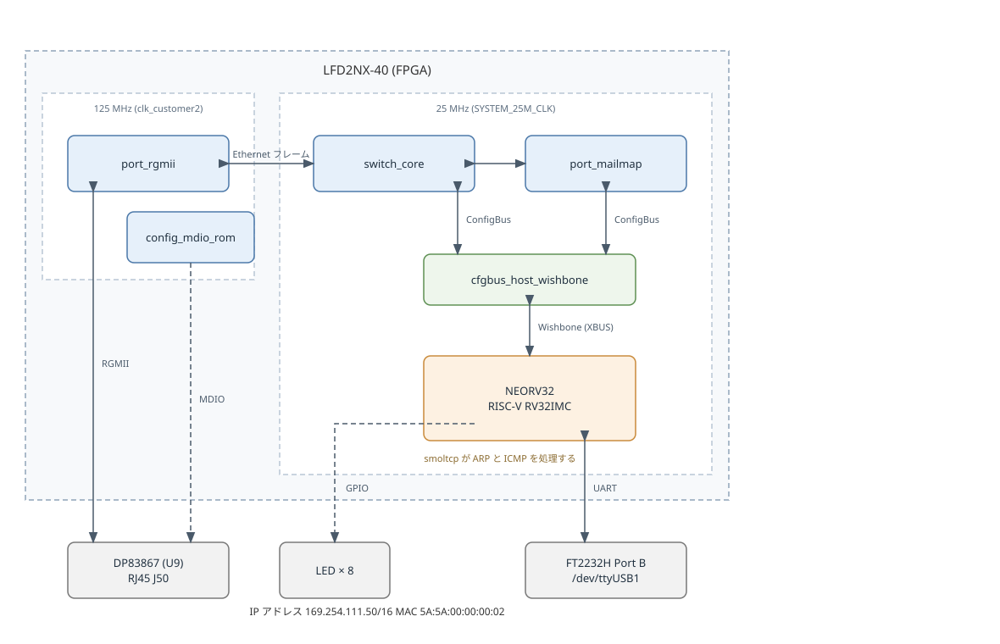

# IP アドレスを持つ Ethernet の端点

LFD2NX-40 に SatCat5 のスイッチと NEORV32 の RISC-V コアを実装し、ボードに IP アドレスを持たせる。
IP の処理は Rust の smoltcp が行い、PC から `ping` が通ることを目標にする。

## 構成

FPGA の中の構成を次の図に示す。
図は `ip_endpoint_block.drawio.svg` で、draw.io で開いて編集できる。



- Ethernet は、ボードに載っている DP83867 と RJ45 をそのまま使う。
- スイッチのポートは、PHY につながる RGMII と、CPU につながる mailmap の 2 つである。
- `port_mailmap` は、フレーム全体をメモリに見せる仮想の内部ポートである。
  CPU から見ると、受信も送信も配列の読み書きになる。
- 押しボタン SW2 を押している間はリセットする。
- LED0 は MDIO の設定が終わったことを示す。
  残りの LED は CPU が動かし、受け取ったフレーム数と毎秒の反転を出す。
- UART は、ブートローダとプログラムの出力に使う。

| ファイル | 内容 |
|---|---|
| `ip_endpoint.vhd` | トップ |
| `ip_endpoint_tb.vhd` | テストベンチ |
| `ip_endpoint.pdc` | ピン割り当て |
| `ip_endpoint_block.drawio.svg` | 内部構成の図 |
| `check_timing.py` | クロックごとにタイミングを確かめる |
| `firmware/` | コアで動かす Rust のプログラム |

## 設計

### クロック

| 範囲 | クロック | 周波数 |
|---|---|---|
| RGMII、MDIO、PHY の起動 | `clk_customer2` (H13) | 125 MHz |
| スイッチコア、ConfigBus、CPU | SYSTEM_25M_CLK (F16) | 25 MHz |

SatCat5 のポートは自前のクロックを持ち、スイッチコアへの受け渡しでクロックを乗り換える。
そのためスイッチコアを PHY と同じ速さで動かす必要がない。

スイッチコアを 25 MHz で動かすのは、配置配線の結果が 125 MHz に届かないためである。
1 バイト幅のパイプラインなので 200 Mbps を扱え、100BASE-TX には足りる。
1000BASE-T でリンクすると、続けて流れる通信には追いつかない。

### タイミングの確かめ方

nextpnr-nexus の `--freq` は設計全体に 1 つの目標しか与えられない。
PDC の `create_clock` も `--sdc` も内部のクロック網には届かず、制約は既定値のままになる。

そこで目標を高いほうの 125 MHz に合わせ、`--timing-allow-fail` で失敗を許した上で、
クロックごとの要求を `check_timing.py` で確かめる。
25 MHz で動く回路が 125 MHz で評価されるため、nextpnr-nexus の警告が 1 件残る。

スイッチコアの出力バッファは 2 KB にしている。
8 KB では送信側のクロックが 112 MHz までしか出ず、125 MHz に届かなかった。
臨界パスは出力 FIFO の読み出し側で、EBR の読み出し遅延が 3.46 ns を占めていた。

### PHY の設定

DP83867 は、リセットを 1 マイクロ秒以上保ち、解除から MDIO の操作まで 195 マイクロ秒以上あける。
電源投入からは 200 ミリ秒以上あけるため、既定値は長いほうに合わせる。

MDIO では拡張レジスタを 2 つ書く。
RGMIICTL で RGMII を有効にし、RGMIIDCTL で送信と受信のクロックのずれを 2.00 ns にする。
ずれは PHY だけで作り、FPGA 側では遅延を入れない。

### CPU とスイッチのつなぎ方

NEORV32 の外部バスは Wishbone なので、SatCat5 の `cfgbus_host_wishbone` に直結できる。
変換回路は要らない。

アドレスの下位 18 ビットが、ConfigBus のデバイス番号 8 ビットとレジスタ番号 10 ビットになる。
CPU からは次の位置に見える。

| ConfigBus のデバイス | CPU から見たアドレス |
|---|---|
| 0 (`switch_core`) | `0x90000000` + レジスタ番号 × 4 |
| 1 (`port_mailmap`) | `0x90001000` + レジスタ番号 × 4 |

NEORV32 は IMEM、DMEM、IO のどれにも当たらないアドレスを外部バスへ出すため、`0x90000000` を使える。

`cfgbus_host_wishbone` はバイトイネーブルを持たない。
フレームはワード単位で読み書きし、バイトへの詰め替えは CPU 側で行う。

### VHDL の版

NEORV32 は VHDL-2008 で書かれ、自身を `neorv32` ライブラリに置くことを前提にしている。
SatCat5 も同じライブラリに入れると、両者の `work` 参照が同じ場所を指す。

SatCat5 は VHDL-93 を想定して書かれているが、`mac_log_core.vhd` の 1 箇所を除いて VHDL-2008 で解析できる。
その 1 箇所は `third_party/satcat5_nexus/patches/` のパッチで直す。

### ファームウェア

`firmware/` に `no_std` の Rust のプログラムを置く。

- `mailmap.rs` が `port_mailmap` を smoltcp の `Device` として扱う。
- ソケットは開かない。ARP と ICMP の応答は smoltcp が IP の層で処理する。
- UART の速度はブートローダが設定した値をそのまま使い、制御レジスタを書き換えない。
- 時刻はマシンタイマの 64 ビットの値から求める。

smoltcp はソケットを 1 つも有効にしないと組み上がらないため、`socket-icmp` を有効にする。

### アドレス

| 項目 | 値 |
|---|---|
| MAC アドレス | `5A:5A:00:00:00:02` |
| IP アドレス | `192.168.1.10/24` |

どちらもローカル管理のアドレスで、`firmware/src/main.rs` に書いている。

## 検証

`make sim` のテストベンチで、次の動作を確認している。

- リセット中は PHY がリセットされたままで、UART の送信線が 1 のまま、RGMII が送信していない。
- リセットを離すと、待ち時間の後に PHY のリセットが解除される。
- MDIO が PHY のレジスタを書き終える。
- ブートローダが UART へ送信を始める。
  CPU がスイッチコアと ConfigBus を抱えた構成でも動き出すことの確認になる。

### 実機での確認

PC と RJ45 を直結し、`ping` が返ることを確認した。

```
Reply from 169.254.111.50: bytes=32 time=1ms TTL=64
    Packets: Sent = 4, Received = 4, Lost = 0 (0% loss)
```

実機で動かすまでに、次の 3 つの不具合を直した。

**ConfigBus で CPU が止まった。**
NEORV32 はストローブを 1 サイクルしか出さず、応答をその次のサイクルから受け付ける。
SatCat5 のブリッジは書き込みの応答をストローブと同じサイクルに返すため、応答が捨てられていた。
応答とデータを 1 サイクル遅らせて解決した。

**フレームが 1 つも届かなかった。**
自動交渉で 1000BASE-T にリンクしていたが、スイッチコアは 25 MHz で 200 Mbps までしか扱えない。
MDIO で 1000BASE-T の広告を止めて 100BASE-TX に落とすと、受信が始まった。

**ARP には応答するが ICMP には応答しなかった。**
smoltcp の自動 echo 応答は `auto-icmp-echo-reply` で囲まれており、既定では無効である。
機能を有効にして解決した。

### 試験に使ったアドレス

`169.254.111.50/16` は、PC 側が DHCP のアドレスを取れずに使うリンクローカルの範囲に合わせた値である。
PC の設定を変えずに試せる。
別のネットワークで使うときは `firmware/src/main.rs` の定数を変える。

## 回路規模

LFD2NX-40-8BG256C で配置配線した結果を次に示す。

| 資源 | 使用量 | 総量 |
|---|---|---|
| LUT | 9,688 | 32,256 |
| FF | 5,146 | 32,256 |
| EBR | 66 | 84 |
| 分散 RAM | 82 | 4,032 |
| I/O | 28 | 111 |

クロックごとの最大周波数を次に示す。

| クロック | 到達 | 必要 |
|---|---|---|
| `rx_data[0]` (RGMII 受信) | 164.6 MHz | 125 MHz |
| `tx_ctrl[0]` (RGMII 送信) | 129.8 MHz | 125 MHz |
| `cfg_cmd[0]` (スイッチと CPU) | 102.1 MHz | 25 MHz |

EBR が一番きつい。命令メモリ 32 KB とデータメモリ 32 KB で使い切る。

合成のログには、ABC が出す `The network is combinational.` という警告が 1 件残る。
これは論理最適化の内部の知らせで、この回路には順序回路も含まれている。

## 実行方法

yosys、GHDL、nextpnr-nexus を含む OSS CAD Suite と、Rust のツールチェーンが必要になる。

```sh
rustup target add riscv32imc-unknown-none-elf
rustup component add llvm-tools
```

```sh
make        # 合成と配置配線、ビットストリームの生成
make sim    # テストベンチ
make load   # FPGA を SRAM にコンフィグする
make upload # ファームウェアを UART から流し込んで実行する
```

`make upload` が使うシリアルポートは `PORT` で変えられる。
