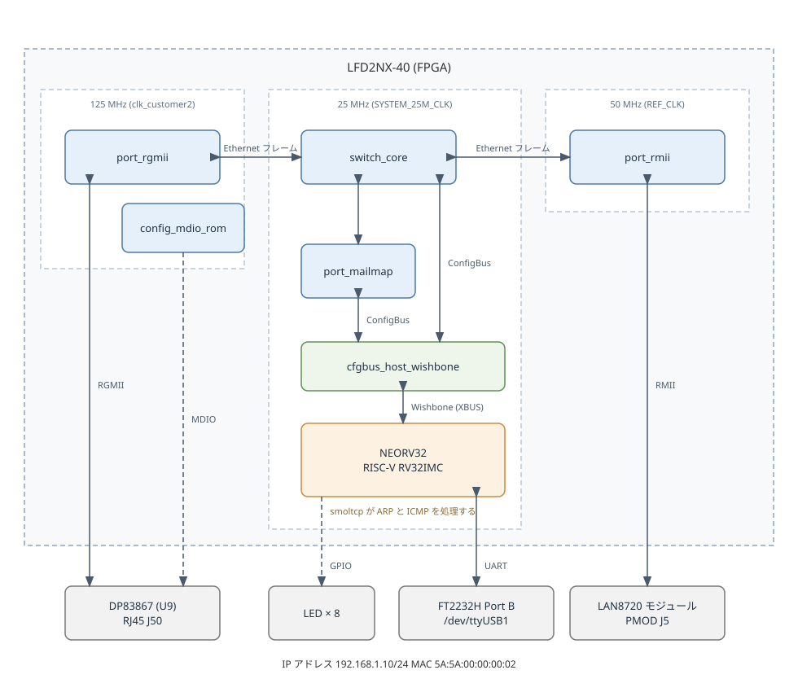

# IP で管理できるスイッチングハブ

SatCat5 のスイッチに NEORV32 の RISC-V コアをつなぎ、スイッチ自身が IP アドレスを持つようにする。
スイッチは、ボードの DP83867 と、PMOD につないだ LAN8720 の間でフレームを中継する。
PC から `ping` を送ると、コアで動く Rust の smoltcp が応答する。
FT2232H のシリアルポートにはコンソールを開き、リンクの状態や設定を見て、設定を変えられるようにする。
設定は SPI Flash に保存し、電源を切っても残す。

## 構成



スイッチのポートは 3 つある。
ボードの DP83867 には RGMII で、PMOD の J6 につないだ LAN8720 のモジュールには RMII でつながる。
残りの 1 つは、CPU につながる `port_mailmap` である。
`port_mailmap` はフレーム全体をメモリとして見せるため、CPU はフレームを配列として読み書きできる。

CPU は、ConfigBus を通して、スイッチコア、ポートごとの統計、DP83867 の MDIO を操作する。
コンソールは、CPU の UART を FT2232H の Port B につないで開く。
設定は、CPU の SPI で、FPGA のコンフィグに使う SPI Flash に書く。
ファームウェアは、PMOD の J5 に出した JTAG から probe-rs で書き込む。

HDL と制約は `hdl/`、ファームウェアは `firmware/`、ビルドで使うスクリプトは `tools/`、図は `doc/` に置く。
probe-rs に渡すメモリの配置は `neorv32.yaml` に置く。

### メモリマップ

ここでは、CPU から見たアドレス、各デバイスのレジスタ、メモリの中の配置、SPI Flash の中の配置を示す。
CPU は、全てのデバイスをメモリマップド I/O として、アドレスへの読み書きで操作する。

#### CPU のアドレス空間

全ての領域は FPGA の中にあり、FPGA の外とは I/O のピンでつながる。

| アドレス | 大きさ | 中身 | FPGA での実体 |
|---|---|---|---|
| `0x00000000` | 64 KB | 命令メモリ | EBR |
| `0x80000000` | 16 KB | データメモリ | EBR |
| `0x90000000` | 4 KB | `switch_core` | SatCat5 のスイッチコア |
| `0x90001000` | 4 KB | `port_mailmap` | CPU のポート |
| `0x90002000` | 4 KB | `cfgbus_port_stats` | ポートごとの統計 |
| `0x90003000` | 4 KB | `cfgbus_mdio` | DP83867 の MDIO のピン |
| `0xFFE00000` | 12 バイト | 起動 ROM | LUT |
| `0xFFF40000` | 64 KB | CLINT のマシンタイマ | FPGA の中のレジスタ |
| `0xFFF50000` | 64 KB | UART0 | TXD_UART と RXD_UART のピン |
| `0xFFF80000` | 64 KB | SPI | SPI Flash のピン |
| `0xFFFC0000` | 64 KB | GPIO | 汎用 LED のピンと、PHY の起動の待ちの完了 |
| `0xFFFE0000` | 64 KB | SYSINFO | FPGA の中のレジスタ |
| `0xFFFF0000` | 64 KB | デバッグモジュール | J5 の JTAG のピン |

`0x90000000` からの 4 つは、ConfigBus のデバイスである。
表にないアドレスは、全て外部バスを通って ConfigBus に届く。
ConfigBus への橋渡しはアドレスの下位 20 ビットしか見ないため、ファームウェアは `0x90000000` からの範囲だけを使う。
命令メモリとデータメモリの位置と大きさは、`hdl/managed_switch.vhd` の generic、`firmware/memory.x`、`neorv32.yaml` で合わせる。

#### ConfigBus のレジスタ

ConfigBus のアドレスは、ビット 19 から 12 がデバイス番号、ビット 11 から 2 がレジスタ番号になる。
レジスタは 32 ビットで、アドレスはレジスタ番号の 4 倍になる。
次の表は、ファームウェアが使うレジスタである。

| デバイス | レジスタ | 向き | 中身 | 使う処理 |
|---|---|---|---|---|
| 0 `switch_core` | 0 | 読み | ポートの数 | `info` |
| | 1 | 読み | データ幅 (ビット) | `info` |
| | 2 | 読み | コアのクロック (Hz) | `info` |
| | 3 | 読み | MAC テーブルの大きさ | `info` |
| | 4 | 書き | プロミスキャスのポートのビットマスク | `set mirror` |
| | 7 | 読み | フレームの長さの上限と下限 | `info` |
| | 11、12 | 読み | MAC アドレステーブルの項目の MAC アドレス | `mac` |
| | 13 | 読み書き | MAC アドレステーブルの操作と、その結果のポートの番号 | `mac` |
| 1 `port_mailmap` | 0 から 399 | 読み | 受信したフレーム | smoltcp の受信 |
| | 511 | 読み書き | 読むと受信したフレームの長さ、書くと次のフレームへ進む | smoltcp の受信 |
| | 512 から 911 | 書き | 送信するフレーム | smoltcp の送信 |
| | 1023 | 読み書き | 書くと送信する長さ、読むと送信中かどうか | smoltcp の送信 |
| 2 `cfgbus_port_stats` | 16n + 1 | 読み | ポート n の受信のブロードキャストのフレーム数 | 1 秒ごとの取り込み |
| | 16n + 2、16n + 3 | 読み | ポート n の受信のバイト数とフレーム数 | 1 秒ごとの取り込み |
| | 16n + 4、16n + 5 | 読み | ポート n の送信のバイト数とフレーム数 | 1 秒ごとの取り込み |
| | 16n + 6 | 読み | ポート n のエラーの数 | 1 秒ごとの取り込み |
| | 16n + 8 | 読み | ポート n の速度と状態 | `status` |
| | どれでも | 書き | 全ポートの数を取り込み、数え直す | 1 秒ごとの取り込み |
| 3 `cfgbus_mdio` | 0 | 読み書き | 書くと MDIO の操作を積み、読むと結果を取り出す | PHY の設定、`status`、LED |

統計のポートの番号は、0 が RGMII、1 が RMII、2 が CPU である。
MDIO で読み書きする DP83867 のレジスタと値は、`firmware/src/dp83867/` にある。
各レジスタの全体の定義は、SatCat5 の次のファイルの先頭のコメントにある。

- `switch_core`: `third_party/satcat5/src/vhdl/common/switch_types.vhd` のうち、ConfigBus のレジスタの一覧
- `port_mailmap`: `third_party/satcat5/src/vhdl/common/port_mailmap.vhd`
- `cfgbus_port_stats`: `third_party/satcat5/src/vhdl/common/cfgbus_port_stats.vhd`
- `cfgbus_mdio`: `third_party/satcat5/src/vhdl/common/cfgbus_mdio.vhd`

#### 内蔵の I/O のレジスタ

ファームウェアは、NEORV32 に内蔵の I/O のうち、次のレジスタを使う。

| アドレス | レジスタ | 使う処理 |
|---|---|---|
| `0xFFF4BFF8`、`0xFFF4BFFC` | CLINT の MTIME の下位と上位 | 時間の計測 |
| `0xFFF50000` | UART0 の CTRL | 速度の設定、送受信の FIFO の状態 |
| `0xFFF50004` | UART0 の DATA | コンソールの送受信 |
| `0xFFF80000` | SPI の CTRL | クロックの設定、送受信の状態 |
| `0xFFF80004` | SPI の DATA | Flash とのやりとり、チップセレクトの操作 |
| `0xFFFC0000` | GPIO の PORT_IN | PHY の起動の待ちの完了 |
| `0xFFFC0004` | GPIO の PORT_OUT | LED |

各レジスタのビットの定義は、`third_party/neorv32/sw/lib/include/` の `neorv32_clint.h`、`neorv32_uart.h`、`neorv32_spi.h`、`neorv32_gpio.h` にある。

#### 命令メモリとデータメモリの中

ファームウェアの配置は、`firmware/memory.x` と `riscv-rt` のリンカスクリプトで決まる。

| 位置 | 中身 |
|---|---|
| 命令メモリの先頭 `0x00000000` | 起動処理 `_start` とプログラム (`.text`) |
| `.text` の後ろ | 起動処理の続き (`.init.rust`) と定数 (`.rodata`) |
| 命令メモリの残り | 空き |
| データメモリの先頭 `0x80000000` | 初期値のある変数 (`.data`)、初期値のない変数 (`.bss`)、初期化しない変数 (`.uninit`) |
| データメモリの残り | スタック。`0x80004000` から下へ伸びる |

今のファームウェアは、命令メモリの約 36 KB を使う。
`.data`、`.bss`、`.uninit` は、defmt の RTT の状態と 1 KB のバッファだけに使う。
フレームのバッファ、smoltcp の状態、コンソールの状態は、全て `main` の中の変数として、スタックに置かれる。
各セクションの位置と大きさは、`llvm-size -A` で確かめられる。

#### SPI Flash の中

Flash は 128 Mbit で、アドレスは `0x000000` から `0xFFFFFF` まである。

| アドレス | 中身 | 書く手段 |
|---|---|---|
| `0x000000` から | FPGA のビットストリーム。今の設計で約 1 MB | `make flash` |
| ビットストリームの後ろから `0xFFEFFF` まで | 空き | — |
| `0xFFF000` から `0xFFFFFF` まで | 保存した設定。先頭の 25 バイトだけを使う | コンソールの `save` |

ファームウェアは Flash に置かず、電源を入れるたびに JTAG から命令メモリに書き込む。

保存する設定の書式は次のとおりで、複数バイトの値はネットワークの並びで置く。
CRC-32 だけは、下位のバイトから置く。

| オフセット | 大きさ | 中身 |
|---|---|---|
| 0 | 4 | `MSW1` の 4 文字。書式を変えたら末尾の番号を上げる |
| 4 | 6 | MAC アドレス |
| 10 | 4 | IP アドレス |
| 14 | 1 | プレフィックス長 |
| 15 | 1 | ゲートウェイがあれば 1、なければ 0xFF |
| 16 | 4 | ゲートウェイの IP アドレス。なければ 0xFF |
| 20 | 1 | ミラーのポートの番号。なければ 0xFF |
| 21 | 4 | オフセット 0 から 20 までの CRC-32 |

## 設計

### クロックとリンク速度

RGMII のポートは、DP83867 に合わせて 125 MHz で動く。
RMII のポートは、LAN8720 のモジュールから来る 50 MHz の REF_CLK で動く。
スイッチコアと CPU は、配置配線の結果が 125 MHz に届かないため、25 MHz で動かす。
ポートとスイッチコアの間では、SatCat5 のポートがクロックを乗り換える。

25 MHz のスイッチコアは 200 Mbps までしか扱えない。
そこでファームウェアが起動時に MDIO で DP83867 を設定し、1000BASE-T を広告させずに 100BASE-TX でリンクさせる。
RGMII のクロックのずれも同じ MDIO の書き込みで PHY に作らせ、FPGA 側では遅延を入れない。
2 つのポートが 100 Mbps で受信し続けると、スイッチコアの処理は上限に達する。

### PHY の設定

PHY のリセットの解除から MDIO を使えるまでの待ちは、FPGA の回路が数える。
待ちが終わると GPIO の入力の最下位が 1 になり、ファームウェアはそれを見てから MDIO で PHY を設定する。
書き込むレジスタと値は、`firmware/src/dp83867/` にある。

MDIO のデータ線は双方向で、SatCat5 の `cfgbus_mdio` は下の階層で 3 状態の出力を作る。
GHDL で合成すると、下の階層を通る双方向のポートはトップのポートとのつながりが切れる。
そのため `third_party/satcat5_nexus` のパッチでデータ線を 3 本の信号に分け、3 状態の出力はトップで書く。

### RMII のタイミング

LAN8720 のモジュールは 50 MHz の発振器を持ち、LAN8720 と FPGA が同じ REF_CLK を受ける。
FPGA は、受信データを REF_CLK の立ち上がりで取り込み、送信データも立ち上がりで出す。

LAN8720 が受信データを保つ時間は、FPGA の入力レジスタが求めるホールド時間より短い。
そこで受信データを I/O の遅延素子で遅らせてから、I/O の入力レジスタで取り込む。
遅延量の求め方は `hdl/managed_switch.vhd` のコメントにある。

この計算に使った FPGA の値は、専用のクロック入力ピンを前提にしている。
PMOD の REF_CLK は一般のピンから入るため、受信のマージンは実機で確かめる必要がある。

### CPU とスイッチのつなぎ方

NEORV32 の外部バスは Wishbone なので、`cfgbus_host_wishbone` を通して ConfigBus を操作できる。

NEORV32 は、応答をストローブの次のサイクルから受け付ける。
ブリッジは書き込みの応答をストローブと同じサイクルに返すため、応答を 1 サイクル遅らせて CPU に渡す。

ブリッジはバイトイネーブルを持たないため、ファームウェアはフレームをワード単位で読み書きする。

### コンソール

コンソールは UART0 を 115200 8N1 で使う。
行の編集には、端末のエスケープシーケンスを使う。
矢印キーは数バイトが続けて届くため、UART の受信と送信の FIFO を 64 バイトにして、バイトを取りこぼさないようにする。

| キー | 動作 |
|---|---|
| 左右の矢印、Ctrl+B、Ctrl+F | カーソルを動かす |
| Home、End、Ctrl+A、Ctrl+E | 行頭と行末へ動かす |
| 上下の矢印、Ctrl+P、Ctrl+N | 入力した行を 8 行までさかのぼる |
| Tab | コマンドと設定の名前を補完し、候補が複数あれば一覧を出す |
| Backspace、Delete、Ctrl+D | 1 文字消す |
| Ctrl+W、Ctrl+U、Ctrl+K | 前の単語、行頭まで、行末までを消す |
| Ctrl+C | 入力中の行を捨てる |
| Ctrl+L | 画面を消して描き直す |

| コマンド | 内容 |
|---|---|
| `help` | コマンドの一覧を出す |
| `status` | ポートごとのリンクの状態と、直近 1 秒の送受信の速さを出す |
| `stats` | 起動からのポートごとの送受信の数、破棄の数、エラーの数を出す |
| `stats clear` | `stats` の数を 0 から数え直す |
| `mac` | MAC アドレステーブルの使われている項目と、学習したポートを出す |
| `mac clear` | MAC アドレステーブルを消す |
| `info` | スイッチコアのポート数、クロック、MAC テーブルの大きさと、起動からの時間を出す |
| `show` | 設定を出す |
| `set ip`、`set gateway`、`set mac`、`set mirror` | 設定を変え、すぐに反映する |
| `save` | 設定を SPI Flash に保存する |
| `defaults` | 設定を既定値に戻す |

DP83867 のリンクは、PHY のレジスタから読む。
LAN8720 の MDIO は PMOD に出していないため、RMII のポートについては REF_CLK のロックと速度だけを出す。
ミラーリングは、指定したポートをスイッチコアのプロミスキャスにして、全てのフレームをそのポートに出す。

統計のブロックは、取り込みのたびに数を 0 に戻す。
そのためファームウェアは 1 秒ごとに数を取り込み、ポートごとに 64 ビットの累計へ足す。
1 秒の間の数は 32 ビットに収まるため、取り込みの間にあふれることはない。
`status` の送受信の速さは、直近の 1 秒のバイト数から求める。
`stats` の破棄は受信と送信の FIFO のあふれ、エラーは MAC と PHY のエラーとフレームの誤りである。

MAC アドレステーブルは、スイッチコアの `mac_query` の操作で、項目を 1 つずつ読む。
空の項目は MAC アドレスが全て 1 で返るため、それを除いて出す。

### 設定の保存

設定は、IP アドレスとプレフィックス長、デフォルトゲートウェイ、MAC アドレス、ミラーリングのポートである。
既定値は `firmware/src/settings.rs` にある。

設定は、SPI Flash の最後の 4 KB の区画に、CRC-32 を付けて書く。
FPGA のビットストリームは Flash の先頭から置かれるため、この区画とは重ならない。
起動時に区画を読み、CRC が合わなければ既定値を使う。

Flash のチップセレクトは、FPGA の CSSPIN につながっている。
Flash は 1 ビットずつの SPI で使い、DQ2 の書き込み保護と DQ3 の HOLD# は 1 にして止めておく。
SPI のクロックは約 98 kHz にする。
この基板の Flash の線は、1 MHz では READ ID が半分ほど失敗し、100 kHz では失敗しなかった。

### ファームウェア

ファームウェアは `port_mailmap` を smoltcp の `Device` として扱う。
ARP と ICMP の echo には smoltcp が応答するため、ソケットは開かない。
主ループは、通信の処理とコンソールの入力を交互に行い、500 ms ごとに PHY のリンクを読んで LED に出す。

`firmware/src/` は、役割ごとに次のように分ける。

| 場所 | 役割 |
|---|---|
| `main.rs` | 起動と主ループ |
| `memory_map.rs` | ConfigBus のデバイスの番地 |
| `ports.rs` | スイッチのポートの番号と名前 |
| `settings.rs` | 設定と、Flash に保存する書式 |
| `traffic.rs` | ポートごとの送受信の速さと累計 |
| `console/` | コンソールの端末の入出力、文字の色、行の編集、コマンド |
| `satcat5/` | SatCat5 の ConfigBus のデバイス |
| `dp83867/` | ボードの Ethernet PHY の DP83867 |
| `mt25q/` | ボードの SPI Flash の MT25QU128 |

レジスタを直接読み書きするのは、次の層だけにする。
上の層は、これらの型を通して周辺を使う。

- NEORV32 に内蔵の UART、SPI、GPIO、マシンタイマは、`crates/neorv32-hal` を通して使う。
- SatCat5 の ConfigBus のデバイスは、`firmware/src/satcat5/` の型を通して使う。
- 各デバイスの番地は、`firmware/src/memory_map.rs` だけに書く。

`dp83867/` と `mt25q/` では、型とその操作を `mod.rs` に置き、レジスタや命令の番号を別のファイルに分ける。
DP83867 は MDIO の型を通して、MT25QU128 は embedded-hal の `SpiDevice` を通して読み書きする。

`cargo run` で JTAG から書き込むための対処は、`projects/riscv_rust/README.md` にまとめてある。
このプロジェクトでは、それに加えて次の 2 つをした。

- 命令メモリの 64 KB に収めるため、開発用のビルドもリリースと同じ最適化にする。
- 使わない巻き戻しの表 `.eh_frame` を、`firmware/memory.x` で捨てる。

### defmt のログ

ファームウェアは、defmt でログを RTT のバッファに書く。
`cargo run` で動く probe-rs が、JTAG からバッファを読んでログを表示する。
ログには、次のものを出す。

| レベル | 内容 |
|---|---|
| info | 設定の読み込みと保存、設定を反映したときの IP アドレス、DP83867 のリンクの変化、RMII の REF_CLK のロック |
| warn | Flash に設定がないこと、RMII の REF_CLK が外れたこと、1 秒の間にエラーか取りこぼしがあったポート |
| debug | CPU が送受信したフレームの長さと Ethernet のヘッダ、smoltcp が捨てたパケット |

ログをどの深さまで出すかは、`firmware/.cargo/config.toml` の `DEFMT_LOG` で決め、既定は info である。
defmt は、この深さより細かいログをビルドの時点で取り除く。
debug のログを見るときは、`DEFMT_LOG=debug cargo run` のように指定してビルドし直す。

probe-rs は、バッファを読むたびにコアを止める。
その理由は、`projects/riscv_rust/README.md` にある。

パニックしたときは、場所を出さずに `panicked` とだけログに出して止まる。

## 検証

`make sim` では、次のことを確かめる。

- リセット中は、PHY がリセットされ、UART と両方のポートが止まり、SPI Flash が選ばれていない。
- リセットを離すと、PHY のリセットが解除される。
- JTAG で読んだ IDCODE が、期待した値になる。
- RMII で受けたフレームが RGMII から、RGMII で受けたフレームが RMII から、そのまま出る。

MDIO、統計、SPI Flash、コンソールは、ファームウェアが動かすため、実機で確かめた。

- DP83867 の RJ45 に PC を直結し、100 Mbps の全二重でリンクして `ping` が返った。
- コンソールで、補完、ヒストリー、行の編集、全てのコマンドが動いた。
- `set ip` で変えたアドレスに `ping` が返り、元のアドレスには返らなくなった。
- `save` の後にコアをリセットし、保存した設定で起動した。
- `set mirror rmii` で、スイッチコアのプロミスキャスのレジスタが RMII のポートを指した。

LAN8720 の側は、まだ実機で確かめていない。

## 回路規模

LFD2NX-40-8BG256C で配置配線した結果を次に示す。

| 資源 | 使用量 | 総量 |
|---|---|---|
| LUT | 15,568 | 32,256 |
| FF | 8,495 | 32,256 |
| EBR | 74 | 84 |
| 分散 RAM | 118 | 4,032 |
| I/O | 45 | 111 |

タイミングの余裕が一番少ないのは RGMII の送信側で、125 MHz に対して 142.2 MHz である。
スイッチコアの出力バッファを 8 KB にすると、ここが 112 MHz に落ちるため、2 KB にしている。

nextpnr-nexus は、設計全体に 1 つの目標周波数しか与えられない。
そのため 25 MHz と 50 MHz の回路も 125 MHz で評価され、125 MHz に届かないときは警告が出る。
この警告は許容し、クロックごとの要求は `tools/check_timing.py` で確かめる。

合成のログには、ABC が出す `The network is combinational.` という警告が 1 件残る。
これは論理最適化の内部の知らせで、回路の不具合を示すものではない。

ファームウェアは、命令メモリの 64 KB のうち約 36 KB を使う。
命令メモリは、32 KB ではファームウェアが入りきらなくなったため、64 KB にした。
データメモリは、スタックと defmt の RTT のバッファに使う。
`main` のスタックは約 5.3 KB なので、データメモリを 16 KB に減らして EBR を空けた。

## 実行方法

OSS CAD Suite と、Rust の RISC-V 向けのツールチェーン、probe-rs の 0.32.0 以降を用意する。

```sh
rustup target add riscv32imc-unknown-none-elf
```

FPGA のコンフィグは `make` で行う。

```sh
make        # 合成と配置配線、ビットストリームの生成
make sim    # テストベンチ
make load   # FPGA を SRAM にコンフィグする
make flash  # FPGA を SPI Flash にコンフィグする
```

ファームウェアは `firmware/` の中で `cargo run` を実行して書き込む。
probe-rs は書き込んだあとも接続を続け、defmt のログを表示する。
Ctrl+C で止めても、ファームウェアは動き続ける。
プローブの配線と、WSL でプローブを使う準備は、`projects/riscv_rust/README.md` と同じである。

```sh
cd firmware
cargo run
```

コンソールには、FT2232H の Port B のシリアルポートから入る。

```sh
tio -b 115200 /dev/ttyUSB1
```

LAN8720 のモジュールは、PMOD の J6 に次のようにつなぐ。
J5 は、NEORV32 の JTAG に使う。
モジュールの電源は、J6 の 3.3 V と GND から取る。

| J6 のピン | 信号 |
|---|---|
| 1 | REF_CLK |
| 2 | CRS_DV |
| 3 | RXD0 |
| 4 | RXD1 |
| 7 | TXEN |
| 8 | TXD0 |
| 9 | TXD1 |

LAN8720 は、電源を入れたときに RXD0、RXD1、CRS_DV の値からモードを読む。
FPGA はコンフィグの間、これらのピンを弱くプルダウンする。
リンクが 100 Mbps の全二重にならないときは、FPGA をコンフィグした後に LAN8720 の電源を入れ直す。

PC 側には、基板のアドレスと同じ範囲の固定のアドレスを割り当てる。
基板のアドレスの既定値は `192.168.1.10/24` で、コンソールの `show` で確かめられる。

```sh
sudo ip addr add 192.168.1.1/24 dev <インターフェース名>
```

LED0 は DP83867 のリンク、LED7 は動作を示す点滅で、残りの LED には受け取ったフレームの数を出す。
LED0 が点灯した後に `ping 192.168.1.10` を送ると、応答が返る。
DP83867 と LAN8720 の RJ45 に 1 台ずつ機器をつなぐと、2 台はスイッチを通して通信できる。
