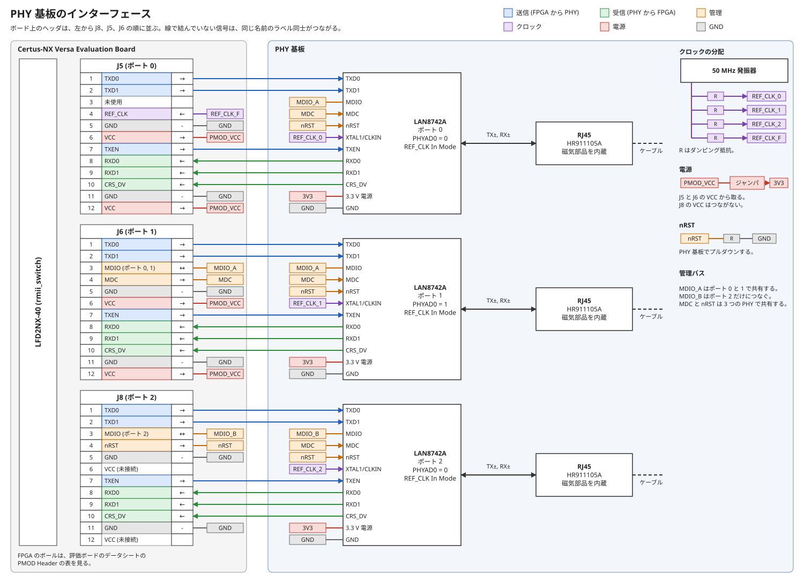

[SatCat5 Ethernet スイッチ](../rmii_switch/README.md) の Ethernet ポートは、PMOD Header に挿す PHY 基板で用意する。
この基板の回路図と基板のデータは、このフォルダに置く。

PMOD Header の各ピンの信号と、PHY 基板の中のつながりを次の図に示す。
図は `phy_board_interface.drawio.svg` で、draw.io で開いて編集できる。

## 構成

- 1 枚の基板に LAN8742A を 3 つ載せ、100BASE-TX のポートを 3 つ作る。
- J8、J5、J6 は、ボードの同じ辺に左からこの順に並ぶ直角のコネクタである。
  PHY 基板は、この 3 つのヘッダにまとめて挿す。
- 基板の外形とヘッダの間隔は、ボードの実物で寸法を測って決める。
- PHY まわりの回路は、`datasheets/LAN8742A-QFN-Rev-A-Schematic-Checklist.md` に従う。

## RJ45

- RJ45 は、磁気部品と LED を内蔵した HanRun の HR911105A を使う。
  JLCPCB の実装に使える部品で、LCSC の部品番号は C12074 である。
- HR911105A は送信側と受信側の磁気部品が対称で、Auto-MDIX に使える。
  LAN8742A の Auto-MDIX には対称な磁気部品が必要だと、Schematic Checklist に書かれている。
- 送信側と受信側のセンタータップは別のピンに出ており、Schematic Checklist のとおりに LAN8742A 側でつなげる。
- ケーブル側の終端は HR911105A に内蔵されているため、PHY 基板には置かない。
- HR911105A のデータシートは PDF から Markdown に変換できなかったため、LCSC の C12074 のページから取得して見る。

## ピン配置

J5 をポート 0、J6 をポート 1、J8 をポート 2 とする。
3 つのヘッダの 3 番と 4 番以外のピンは、同じ配置にする。

| PMOD ピン | 信号 | 向き |
|---|---|---|
| 1 | TXD0 | FPGA から PHY |
| 2 | TXD1 | FPGA から PHY |
| 5、11 | GND | — |
| 6、12 | VCC | — |
| 7 | TXEN | FPGA から PHY |
| 8 | RXD0 | PHY から FPGA |
| 9 | RXD1 | PHY から FPGA |
| 10 | CRS_DV | PHY から FPGA |

3 番と 4 番のピンは、ヘッダごとに次の信号にする。

| ヘッダ | 3 番ピン | 4 番ピン |
|---|---|---|
| J5 | 未使用 | REF_CLK、PHY 基板から FPGA |
| J6 | ポート 0 と 1 の MDIO、双方向 | MDC、FPGA から PHY |
| J8 | ポート 2 の MDIO、双方向 | nRST、FPGA から PHY |

- 各ピンにつながる FPGA のボールは、`datasheets/FPGA-EB-02032-1-2-Certus-NX-Versa-Evaluation-Board.md` の PMOD Header の表を見る。
- GND と VCC のピンは、同じファイルの回路図で J5、J6、J8 のシンボルを見る。
- REF_CLK は J5 だけにつなぐ。
  全ポートが同じ REF_CLK で動くため、FPGA に入れるのは 1 本でよい。
- J5 の 3 番ピンは、REF_CLK の隣なので使わない。
- MDIO は 2 本に分ける。
  LAN8742A のストラップで設定できる PHY アドレスは 2 通りしかなく、3 つの PHY で 1 本のバスを共有できないためである。
- MDC と nRST は、3 つの PHY で共有する。
- nRST は PHY 基板でプルダウンし、FPGA がコンフィグを終えてから解除する。
  MODE[2:0] のストラップは nRST の解除で取り込まれ、そのピンは FPGA の入力につながっているためである。
  Certus-NX の I/O は電源投入から POR の解除まで状態が不定だと、`datasheets/FPGA-DS-02078-2-5-Certus-NX-Family.md` に書かれている。

## LAN8742A の設定

LAN8742A はストラップで設定する。
ストラップの詳細は、`datasheets/DS_LAN8742_00001989A.md` の Configuration Straps の節を見る。

- MODE[2:0] は、全ての機能を広告してオートネゴシエーションを行う設定にする。
- nINTSEL は、REF_CLK In Mode を選ぶ値にする。
- REGOFF は、内蔵の 1.2 V レギュレータを使う値にする。
- PHYAD0 は、ポート 0 と 2 を 0、ポート 1 を 1 にする。
- RXD0、RXD1、CRS_DV は FPGA に、LED1 と LED2 は LED につながる。
  負荷がつながるストラップのピンには外付けの抵抗が必要なため、これらのピンに抵抗を付けて値を決める。

## 電源

- PHY 基板の 3.3 V は、J5 と J6 の VCC から取り、外部からは給電しない。
  ボードと電源が 1 つになり、片方だけに電源が入る状態が起きないためである。
- J5 と J6 の VCC は、FPGA 用の DC/DC が作る VCC_3V3 である。
  出力できる電流は、ボードのファイルの回路図の Power Regulators の図を見る。
  LAN8742A の消費電流は、LAN8742A のデータシートの Power Consumption の節を見る。
- VCC_3V3 はボードの他の回路にも使われている。
  PHY 基板をつなぐ前に、J42 で VCC_3V3 の電流を測り、余裕があることを確認する。
  J42 は電流測定用のジャンパで、VCC_3V3 に直列に入る 0.1 Ω の抵抗と並列につながっている。
- PHY 基板の VCC の入口に、2 ピンのジャンパを直列に入れる。
  ジャンパを外すと、PHY 基板の電流を測ることも、ボードから電源を切り離すこともできるためである。
- J8 の VCC は、PHY 基板の電源につながない。
  J8 の VCC は J48 で 1.8 V に切り替えられるため、つなぐと 3.3 V と短絡するおそれがある。
- J8 の信号は VCCIO6 で動くため、J48 は既定の 3.3 V で使う。

## クロック

- PHY 基板に 50 MHz の発振器を 1 つ置き、3 つの LAN8742A の XTAL1/CLKIN と、J5 の REF_CLK に分配する。
- 分配にはファンアウトバッファを使わず、発振器の出力から 4 本に分け、それぞれにダンピング抵抗を入れる。
  発振器から PHY と MAC に分けるときに、それぞれへ直列抵抗を入れることが Schematic Checklist で推奨されている。
- 発振器は、4 か所の負荷をまとめて駆動できるものを選ぶ。
- LAN8742A は REF_CLK In Mode で使う。
  REF_CLK Out Mode は RMII の規格外で、MAC とのタイミング解析が必要だとデータシートに書かれているためである。
- 発振器は、LAN8742A のデータシートの RMII CLKIN Requirements の表を満たすものを選ぶ。
- 発振器から 3 つの LAN8742A と J5 までの配線長をそろえる。
  FPGA は 3 つの PHY の受信データを、同じ REF_CLK で取り込むためである。

## REF_CLK を PHY 基板から供給する理由

- PMOD Header のピンには、クロック専用の PCLK のピンがない。
  どちらの向きでも、FPGA 側の REF_CLK は一般のピンで扱うことになる。
- FPGA から REF_CLK を出すと、受信の経路に FPGA の出力遅延と LAN8742A の出力遅延が積み重なる。
  2 つの遅延と FPGA のセットアップ時間を足すと、50 MHz の 1 周期を超える。
  Certus-NX の値は、FPGA のファイルの General I/O Pin Parameters の表を見る。
  LAN8742A の値は、LAN8742A のデータシートの RMII Timing (REF_CLK In Mode) の表を見る。
- PHY 基板から REF_CLK を供給すると、受信ではクロックとデータが同じ向きに進むため、PMOD の配線遅延が打ち消し合う。
- 一般のピンから入れた REF_CLK は、nextpnr-nexus が DCC を通してクロック網に載せる。

## FPGA 側の条件

- 送信データは REF_CLK の立ち上がりで出す。
  立ち下がりで出すと、半周期に FPGA の出力遅延が加わり、LAN8742A のセットアップ時間を満たせないためである。
  SatCat5 の `port_rmii` では、`MODE_CLKOUT` と `MODE_CLKDDR` を両方とも `false` にする。
- 受信データには、FPGA の入力で遅延を入れる。
  LAN8742A が受信データを保持する最小時間は、PLL を使わない場合の Certus-NX の入力レジスタのホールド時間より短いためである。
  入力遅延を使ったときのホールド時間は、この最小時間より短い。
